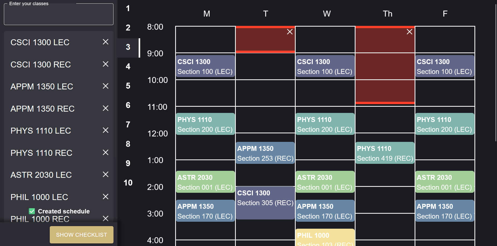

# How to deploy/test

After cloning the repo, run `npm run dev` to create a local instance of the tool

# CU Scheduler

Use this website to quickly build next semester's course schedule around your available times! Automatically avoid waitlisted classes and select preferred instructors. This is a personal project that I created to solve the difficulties of creating a class schedule, it is not affiliated with CU Boulder.

See the deployed project at [cuscheduler.com](https://www.cuscheduler.com)!

## Details

This project uses Integer Linear Programming (ILP) under the hood to optimize the placement of classes by minimizing a cost function. There are many factors that go into the cost function, such as if it is marked to avoid the timeframe or if the professor is marked as unpreferred. This site is developed with Next.JS on the front- and back-end.

